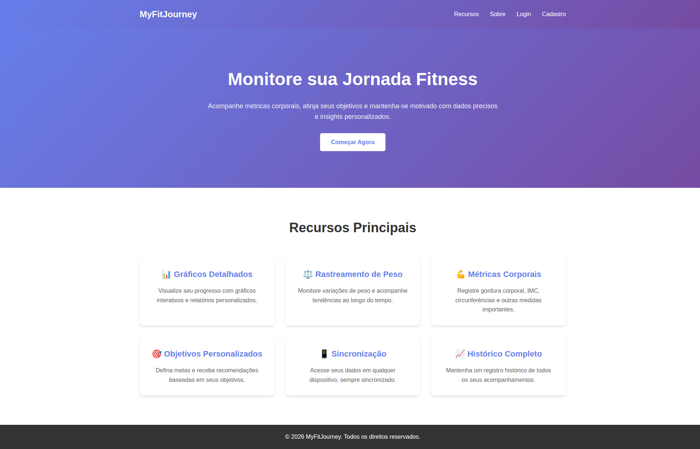
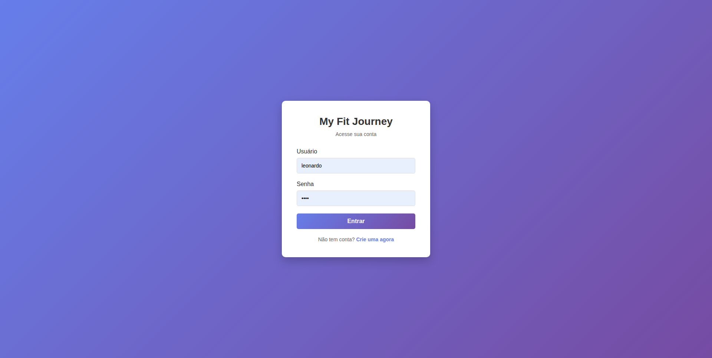
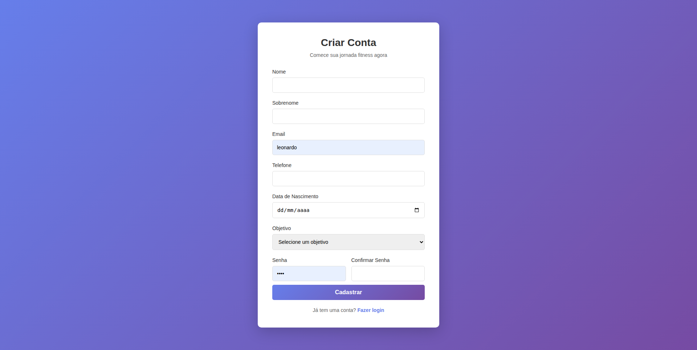

# My Fit Journey
My fit Journey é uma aplicaçao voltada para monitoramento de metricas corporais para quem esta tentando emagrecer.

O projeto é feito inteiramente em python, django, html, css e javascript. 
## Rodando o projeto na sua máquina
Para rodar o projeto na sua maquina é simples. Basta seguir os passos abaixo:
### Clonando o repositorio
O primeiro passo é clonar o repositorio para sua máquina:
```bash
git clone https://github.com/leonhardc/my-fit-journey
```
### Instalando e iniciando o ambiente virtual
Depois de clonar o repositorio, voce tem que executar os passos abaixo para criar e ativar um ambiente virtual na sua máquina:
```bash
# Entrar na página do projeto
cd my-fit-journey
```
```bash
# Criar o ambiente virtual
python3 -m venv nome_do_ambiente_virtual
```
```bash
# Ativar o ambiente virtual
# No Windows
./nome_do_ambiente_virtual/Scripts/activate
# No linux
source nome_do_ambiente_virtual/bin/activate
```
Depois de concluir os tres passos acima, voce esta pronto para o proximo passo, instalar as dependencias do projeto
### Instalando as dependencias do projeto
Voce ira notar que entre os arquivos do projeto existe um que se chama requirements.txt. Nesse arquivo ha todas as dependencias que o projeto precisa para funcionar. Para instala-las voce so precisa executar o comando abaixo:
```bash
pip install -r requirements.txt
```
Depois disso, esta quase tudo pronto. A unica coisa que precisamos fazer é executar as migracoes do projeto. Entao vamos la.
### Fazendo as migracoes do projeto
Como na nossa aplicacao so temos um app chamado usuario, para fazermos a migracao dele basta executarmos o comando a seguir com o ambiente virtual ativado e as dependencias instaladas. 
```bash
# Fazer as migracoes
python3 manage.py makemigrations usuario
```
```bash
# Aplicar as migracoes no banco de dados
python3 manage.py migrate
```
Depois de executar os dois comandos anteriores voce ira notar que apareceu um novo arquivo no diretorio do seu projeto chamado db.sqlite3. Esse é o banco de dados da aplicacao.

Ufa! Pronto! Esta tudo preparado para que possamos rodar o projeto. Para isso veja a proxima secao.
### Rodando o projeto
Primeiro passo é rodar o servidor da aplicacao.
```bash
# Rodar o servidor do projeto
python3 manage.py runserver
```
Se tudo estiver OK ate aqui sera exibido algo parecido com isso no seu terminal
```bash
Watching for file changes with StatReloader
Performing system checks...

System check identified no issues (0 silenced).
March 24, 2026 - 17:47:51
Django version 5.2.12, using settings 'app.settings'
Starting development server at http://127.0.0.1:8000/
Quit the server with CONTROL-C.
```
Pronto, nossa aplicacao esta no ar. Agora voce deve ir no seu navegador e acessar o IP `http://127.0.0.1:8000/` e brincar como voce quiser.
## Imagens do Projeto
Confira abaixo algumas imagens de como esta ficando o projeto.
### Pagina Inicial

### Pagina de Login

### Pagina de Cadastro

### Dashboard
